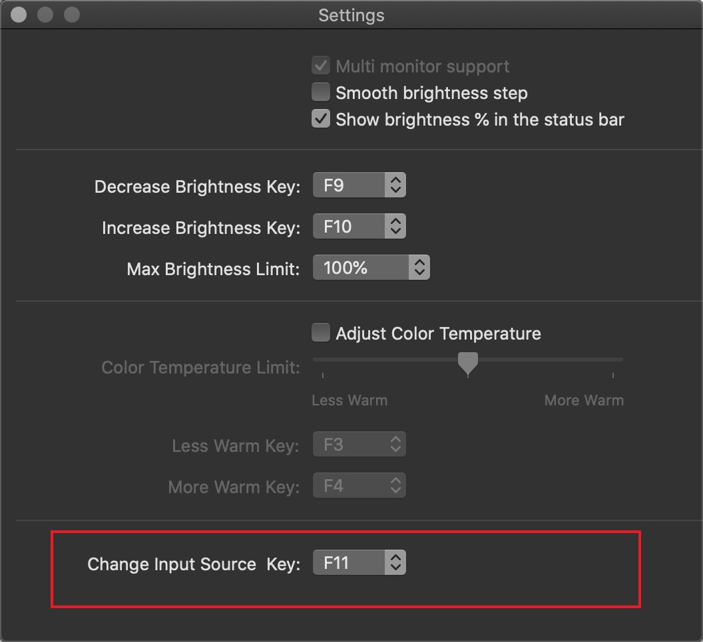

# NativeDisplayBrightnessPlus

*2012款MACBOOK PRO使用EGPU外置显卡教程:*  [http://1vr.cn/?p=2239](http://1vr.cn/?p=2239)

*使用热键控制外屏显示器的亮度,色温,输入源等

用`F1` /  `F2`能改变外屏的亮度
用 `F12`  可以更改显示器的输入源

快捷键可以从`F1`-`F20`中设定

更改亮度时使用了原生系统亮度调整的UI,所以它使用了私有的`BezelServices`框架.

## 显示器兼容性

显示器需要支持DDC/CI才能使用该工具控制.

## 支持多显示器

如果有多台外接显示器,软件将控制当前激活的显示器.

## 系统版本需求

macOS: 10.12.4以后

## License
基于 [https://github.com/KAMIKAZEUA/NativeDisplayBrightness](https://github.com/KAMIKAZEUA/NativeDisplayBrightness)的项目增加了输入源控制功能.

借鉴使用了[ddcctl](https://github.com/kfix/ddcctl) 及 [DDC-CI-Tools](https://github.com/jontaylor/DDC-CI-Tools-for-OS-X)的代码.
